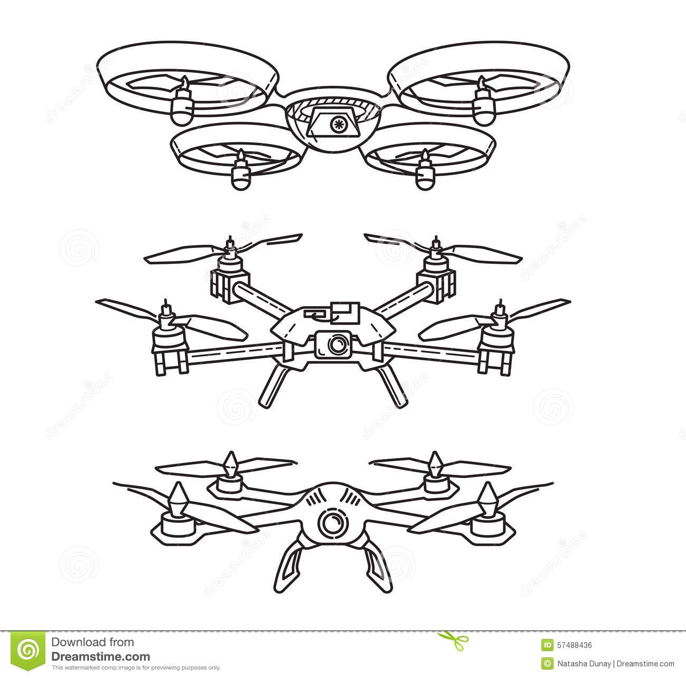
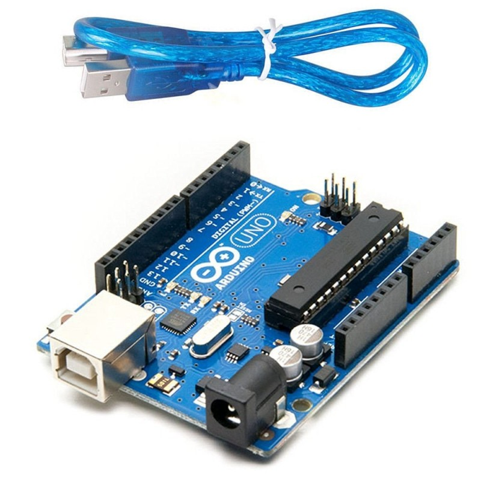
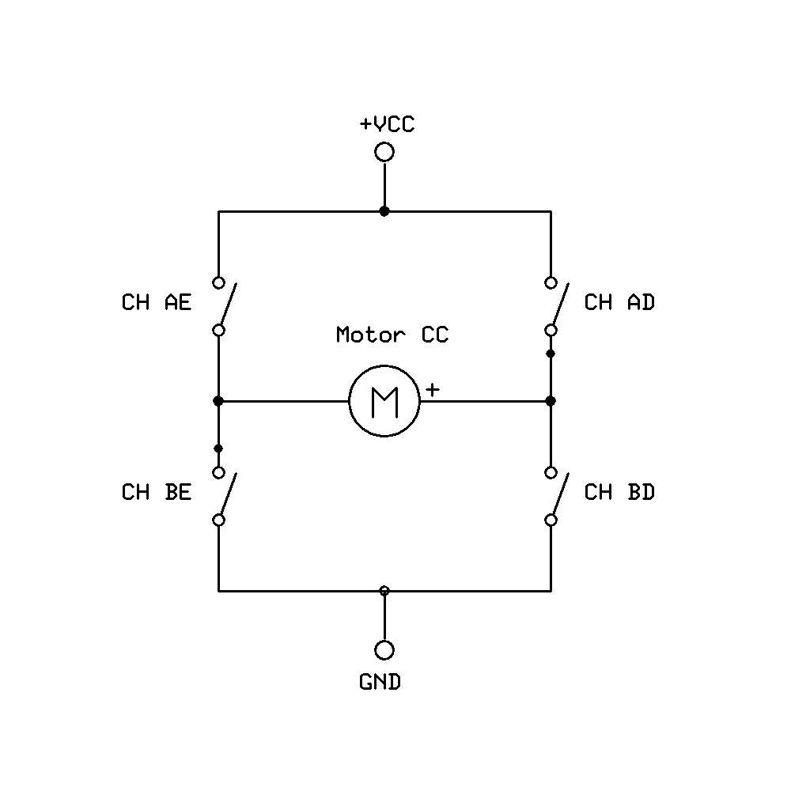

<div style="text-align: center;">
  
</div>

**Curso Profissional “Técnico de Gestão de Equipamentos Informáticos”**
## Relatório do Projeto Final
# “Carro controlado remotamente com sistema de segurança”

**Diretor de Curso / Orientador: João Lopes** 
**Formando: José Simões / Henrique Esteves**
**Turma: R**
**Ano lectivo: 2022/2023**

## Resumo 
Este relatório tem como objetivo apresentar o resultado do projeto de desenvolvimento de um carro controlado remotamente, desenvolvido por José Simões e Henrique Esteves. Este projeto utiliza um comando IR para controlar  um carro e um sensor  ultrassónico para evitar colisões e acidentes. O projeto foi desenvolvido em duas etapas, sendo que primeiro foi construído um carro sem o sensor ultrassónico e posteriormente, após a conclusão da programação, foi construído outro carro com o sensor ultrassónico. Os carros utilizam baterias recarregáveis (9v e 4*1,5v) para alimentação. A conclusão do projeto foi possível graças ao apoio fundamental do professor  João Lopes.

## Introdução
Na atualidade, a robótica e a automação estão a desempenhar um papel fundamental nas nossas vidas. Por exemplo, os drones estão a mudar a forma como realizamos tarefas, sejam elas de entrega de pacotes, inspeção de áreas inacessíveis ou até mesmo como ferramenta de entretenimento. A indústria e a saúde também investem na automação para garantir a qualidade e segurança nas suas operações. A integração da robótica na educação é cada vez mais importante, com plataformas como a Raspberry Pi e Arduino, que fornecem recursos para os estudantes aprenderem sobre robótica e programação. Essas plataformas já ajudaram a formar uma nova geração de profissionais, permitindo a criação de inovações como os robôs da Boston Dynamics e outros avanços na robótica.


Figura 1– Exemplos de drones simples.

A disciplina de Eletrónica fundamental é uma parte crucial do curso profissional "Técnico de Gestão de Equipamentos Informáticos" (GEI). Ela tem como objetivo preparar os estudantes para o mercado de trabalho competitivo, uma vez que existe uma grande procura por profissionais capacitados na área das tecnologias de informação. (O projeto final) de Eletrónica fundamental teve como objetivo permitir que os formandos pudessem aplicar e demonstrar as habilidades adquiridas durante o curso. Além disso, o projeto também teve um aspeto "verde" ao reutilizar material eletrónico que estava parcialmente abandonado. A disciplina contribui para a formação de profissionais capacitados e conscientes da importância da sustentabilidade.

## Designação do projeto
O projeto "Carro controlado remotamente com sistema de segurança" foi concluído com sucesso. Este projeto consistiu na construção de dois carros robôs, que eram controlados remotamente através de comandos IR. Os dois carros foram equipados com sensores, incluindo um sensor IR e outro ultrassónico, que foram cruciais para garantir a segurança do carro durante a sua operação.
O primeiro carro foi construído utilizando um Arduino Uno, enquanto que o segundo carro foi construído utilizando um Arduino Nano. O objetivo desta escolha foi reutilizar o material eletrónico que estava parcialmente abandonado e colocá-lo em bom uso. A escolha do Arduino Nano permitiu uma construção mais compacta e eficiente.
Os sensores IR e ultrassónico foram programados para trabalhar em conjunto para evitar colisões e acidentes. O carro era capaz de detectar obstáculos à sua frente e mudar de direção para evitá-los, garantindo a segurança da sua operação.

Figura 3 - Primeiro protótipo com sensor ultrassónico

Componentes e materiais utilizados

Tabela 1 – material utilizado

 Nome do componente | Quantidade | Função do componente |
| :----: | :------: | :-------: |
| Arduino UNO e Nano |    1     |    Microcontrolador     |
| Ponte H |    2    |    Controlar o sentido de rotação (RPM) e a velocidade do motor     |
| Bateria 9V e 6V (1,5v * 4) |     2    |    Fonte de energia     |
| Recetor IR |     2     |     Controlar remotamente o carro robô (infravermelhos)     |
| Jumpers |     Vários    |    Permitir a ligação dos componentes     |
| Breadboard |    2     |     Facilitar a instalação dos vários componentes do projeto    |
| Sensor Ultrassónico |     1    |    Sistema de segurança     |


## Breve descrição dos componentes utilizados:
Neste ponto serão descritos de forma resumida alguns dos componentes mais importantes deste projeto.

### Arduino UNO (MICROCONTROLADOR)
Arduino é uma plataforma de prototipagem eletrónica de código aberto que permite que pessoas sem conhecimento avançado em eletrônica e programação desenvolvam projetos interativos com facilidade. É composta por uma placa com microcontrolador e uma linguagem de programação baseada em C/C++. A sua simplicidade e acessibilidade tornaram-na extremamente popular entre estudantes e profissionais de diversas áreas. Com o Arduino, é possível controlar luzes, sensores, motores, entre outros componentes eletrônicos, criando assim projetos incríveis e inovadores.



Figura 4 – Arduino Uno

### Ponte H
Uma ponte H é um circuito eletrónico utilizado para controlar a direção de um motor elétrico. A ponte H é composta por quatro interruptores (normalmente transístores) que podem ser controlados independentemente para mudar a polaridade da corrente elétrica que flui através do motor.

A ponte H recebe o nome por causa da sua configuração em forma de "H", onde o motor é ligado na interseção dos interruptores. Ao ligar e desligar os interruptores de forma adequada, a ponte H permite que a corrente elétrica flua em ambas as direções através do motor, permitindo assim que o motor gire nos dois sentidos. Além disso, ao variar a velocidade de rotação do motor, os interruptores podem ser ligados e desligados rapidamente para controlar a quantidade de corrente elétrica que flui através do motor.

As pontes H são amplamente utilizadas em robótica e automação, especialmente para controlar motores de corrente contínua (DC) ou motores de passo.


Figura 7 – Esquema de um circuito “Ponte H”
 
### Recetor IR
O sensor IR é um dispositivo eletrónico que deteta a radiação infravermelha emitida por objetos ou organismos. A radiação infravermelha é um tipo de onda eletromagnética que não é visível a olho nu, mas que é percebida pelo sensor IR. Este tipo de tecnologia é amplamente utilizado em diversas áreas, desde sistemas de segurança, automação industrial, controlo remoto de aparelhos eletrónicos, até à medicina.

O funcionamento do sensor IR baseia-se na deteção da radiação infravermelha através de um circuito eletrónico sensível a este tipo de radiação. Quando um objeto ou organismo emite radiação infravermelha, esta é detetada pelo sensor e convertida em um sinal elétrico. Este sinal elétrico pode ser processado por um microcontrolador ou outro tipo de dispositivo eletrónico para executar diversas ações, tais como ligar ou desligar um aparelho, medir a temperatura de um objeto ou detetar a presença de objetos em um determinado espaço.

A estrutura básica de um receptor IR consiste em um fotodíodo ou fototransístor que é sensível à luz infravermelha, um filtro que bloqueia a luz visível e permite apenas a luz infravermelha passar, e um amplificador que amplifica o sinal elétrico gerado pelo fotodíodo ou fototransístor.

Para conectar o recetor IR ao Arduino, geralmente é necessário apenas conectar o pino de sinal do recetor IR a um dos pinos digitais do Arduino. O sinal enviado pelo recetor IR é digital e é geralmente codificado em algum protocolo. O Arduino pode usar bibliotecas específicas para decodificar esses sinais e executar ações com base neles.

Existem diversos tipos de sensores IR, tais como sensores passivos que são os que vão ser utilizados neste projeto, estes detetam a radiação infravermelha emitida por objetos, ou sensores ativos, que emitem a própria radiação infravermelha e detetam o seu reflexo nos objetos. Além disso, os sensores IR podem ter diferentes comprimentos de onda, o que os torna adequados para diferentes aplicações. Por exemplo, os sensores com comprimento de onda curto são utilizados para medir a temperatura de objetos muito quentes, enquanto os sensores com comprimento de onda mais longo são utilizados em sistemas de segurança para detetar a presença de pessoas ou animais.


## Segmento de código considerado mais importante
Um dos segmentos de código mais importante refere-se à instrução “switch case”, que inicia as funções responsavéis pela movimentação do carro, dependendo do valor descodificado enviado pelo comando.

```c
void loop(){
  if (getDistance() < 15 ) {
    driveBackward(); // Go back
    delay(500);
    stop();
    return; // Exit the loop
  }
  if (irrecv.decode()) { 
    Serial.println(irrecv.decodedIRData.command);
    if (irrecv.decodedIRData.command == 116) { // Forward
      Serial.println("Drive Forward");
      driveForward();
    }
    else if (irrecv.decodedIRData.command == 51) { // Right
      Serial.println("Turn Right");
      turnRight();
    }
    else if (irrecv.decodedIRData.command == 52) { // Left
      Serial.println("Turn Left");
      turnLeft();
    }
    else if (irrecv.decodedIRData.command == 117) { // Backwards
      Serial.println("Drive Backward");
      driveBackward();
    }
    else if (irrecv.decodedIRData.command == 101) { // OK
      stop();
    }
    irrecv.resume(); // Receive the next value
    delay(100);
  }
}
```

## Código completo
```c
#include <IRremote.h>

const int RECV_PIN = 13;
IRrecv irrecv(RECV_PIN);
decode_results results;

// Pinos dos motores
const int MOTOR_LEFT_IN_1 = 7;
const int MOTOR_LEFT_ENABLE = 9;
const int MOTOR_LEFT_IN_2 = 8;
const int MOTOR_RIGHT_IN_1 = 4;
const int MOTOR_RIGHT_ENABLE = 3;
const int MOTOR_RIGHT_IN_2 = 5;

// Pinos para sonar
const int TrigPin = 12;
const int EchoPin = 11;

void setup(){
  Serial.begin(9600);
  irrecv.enableIRIn();
  
  // Configura os pinos dos motores
  pinMode(MOTOR_LEFT_IN_1, OUTPUT);
  pinMode(MOTOR_LEFT_IN_2, OUTPUT);
  pinMode(MOTOR_RIGHT_IN_1, OUTPUT);
  pinMode(MOTOR_RIGHT_IN_2, OUTPUT);
  pinMode(MOTOR_RIGHT_ENABLE, OUTPUT);
  pinMode(MOTOR_LEFT_ENABLE, OUTPUT);
  pinMode(TrigPin, OUTPUT);
  pinMode(EchoPin, INPUT);
}

void loop(){
  // Para o carrinho sem sensor, comentar este bloco.
  if (getDistance() < 15 ) {
    driveBackward(); // Go back
    delay(500);
    stop();
    return; // Exit the loop
  }
  if (irrecv.decode()) { 
    Serial.println(irrecv.decodedIRData.command);
    if (irrecv.decodedIRData.command == 116) { // Forward
      Serial.println("Drive Forward");
      driveForward();
    }
    else if (irrecv.decodedIRData.command == 51) { // Right
      Serial.println("Turn Right");
      turnRight();
    }
    else if (irrecv.decodedIRData.command == 52) { // Left
      Serial.println("Turn Left");
      turnLeft();
    }
    else if (irrecv.decodedIRData.command == 117) { // Backwards
      Serial.println("Drive Backward");
      driveBackward();
    }
    else if (irrecv.decodedIRData.command == 101) { // OK
      stop();
    }
    irrecv.resume(); // Receive the next value
    delay(100);
  }
}

float getDistance() {
  long duration, distance;
  digitalWrite(TrigPin, LOW);  // Set Trig pin low for 2 microseconds
  delayMicroseconds(2);
  digitalWrite(TrigPin, HIGH); // Set Trig pin high for 10 microseconds
  delayMicroseconds(10);
  digitalWrite(TrigPin, LOW);  // Set Trig pin low again
  duration = pulseIn(EchoPin, HIGH); // Measure the duration of the Echo pulse
  distance = duration * 0.034 / 2; // Calculate the distance in centimeters
  return distance;
}


void driveForward() {
  // Define a velocidade dos motores para frente
  digitalWrite(MOTOR_LEFT_IN_1, LOW);
  digitalWrite(MOTOR_LEFT_IN_2, HIGH);
  digitalWrite(MOTOR_RIGHT_IN_1, LOW);
  digitalWrite(MOTOR_RIGHT_IN_2, HIGH);
  digitalWrite(MOTOR_RIGHT_ENABLE, HIGH);
  digitalWrite(MOTOR_LEFT_ENABLE, HIGH);
}

void turnRight() {
  // Define a velocidade do motor esquerdo para frente e a do motor direito para trás
  digitalWrite(MOTOR_LEFT_IN_1, HIGH);
  digitalWrite(MOTOR_LEFT_IN_2, LOW);
  digitalWrite(MOTOR_RIGHT_IN_1, LOW);
  digitalWrite(MOTOR_RIGHT_IN_2, HIGH);
  digitalWrite(MOTOR_RIGHT_ENABLE, HIGH);
  digitalWrite(MOTOR_LEFT_ENABLE, HIGH);
}

void turnLeft() {
  // Define a velocidade do motor esquerdo para trás e a do motor direito para frente
  digitalWrite(MOTOR_LEFT_IN_1, LOW);
  digitalWrite(MOTOR_LEFT_IN_2, HIGH);
  digitalWrite(MOTOR_RIGHT_IN_1, HIGH);
  digitalWrite(MOTOR_RIGHT_IN_2, LOW);
  digitalWrite(MOTOR_RIGHT_ENABLE, HIGH);
  digitalWrite(MOTOR_LEFT_ENABLE, HIGH);
}

void driveBackward() {
  // Define a velocidade dos motores para trás
  digitalWrite(MOTOR_LEFT_IN_1, HIGH);
  digitalWrite(MOTOR_LEFT_IN_2, LOW);
  digitalWrite(MOTOR_RIGHT_IN_1, HIGH);
  digitalWrite(MOTOR_RIGHT_IN_2, LOW);
  digitalWrite(MOTOR_RIGHT_ENABLE, HIGH);
  digitalWrite(MOTOR_LEFT_ENABLE, HIGH);
}

void stop() {
  // Define a velocidade dos motores como 0
  digitalWrite(MOTOR_LEFT_ENABLE, LOW);
  digitalWrite(MOTOR_RIGHT_ENABLE, LOW);
  Serial.println("Stopped");
}
```


Dificuldades encontradas na realização do trabalho
Algumas das dificuldades encontradas na execução deste projeto são referidas de modo abreviado.
Deficiências no material utilizado:
O material utilizado tinha algumas imperfeições, o que dificultou os testes e otimização do trabalho.
Tempo disponível:
Devido às limitações de tempo foi difícil concluir todos os objetivos que tínhamos em mente, como montar uma placa de circuíto soldada e utilizar apenas uma bateria.

## Conclusão
Ao longo deste projeto, tivemos a oportunidade de desenvolver as nossas habilidades em robótica e eletrónica, graças à ajuda valiosa do nosso professor João Lopes. Foi um prazer trabalhar neste projeto e ver a realização do nosso objetivo de construir um carro controlado remotamente com sistema de segurança. Além disso, tivemos a oportunidade de aprender sobre componentes eletrónicos como ponte H, sensores IR e ultrassónicos, bem como sobre programação de microcontroladores com o Arduino Uno e o Nano.

A construção destes carros foi um grande desafio, mas também uma oportunidade incrível para aplicarmos o que aprendemos em sala de aula, e para explorarmos novas áreas de conhecimento. A criação destes veículos também nos permitiu reutilizar material eletrónico parcialmente abandonado, o que é uma realização importante em termos de sustentabilidade.

Em resumo, este projeto foi uma grande jornada de aprendizagem e descoberta. Agradecemos ao nosso professor João Lopes pelo seu apoio e ensinamentos durante todo o processo. Esperamos continuar a aplicar os conhecimentos adquiridos neste projeto em futuros desafios e aventuras.

